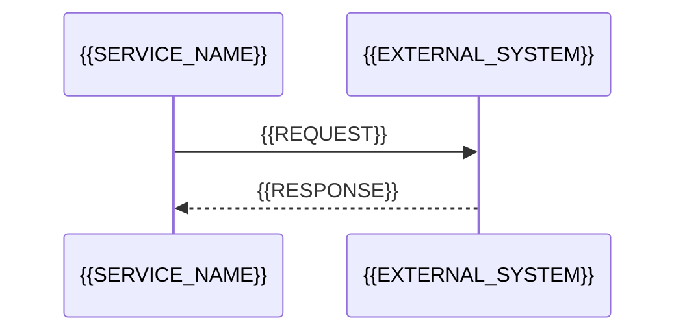

# Архитектура {{SERVICE_NAME}}

> **Версия:** {{VERSION}}
> **Дата обновления:** {{DATE}}
> **Назначение:** {{ONE_LINE_PURPOSE}}
> **Команда:** {{TEAM_OR_UNKNOWN}}

<!-- ИНСТРУКЦИЯ: Это эталонная структура главного архитектурного документа. Заполняй только те разделы, которые подтверждаются фактами из кода. Неподтверждённые разделы — удалять целиком вместе с пунктом в «Содержании». Все HTML-комментарии в финальном документе удалить. Порядок разделов сохранять: от общего к частному. -->

---

## Содержание

<!-- ИНСТРУКЦИЯ: сгенерировать оглавление по итоговым (после удаления пустых) разделам с якорями. -->

1. [Назначение сервиса](#1-назначение-сервиса)
2. [Технологический стек](#2-технологический-стек)
3. [Высокоуровневая архитектура](#3-высокоуровневая-архитектура)
4. [Структура проекта](#4-структура-проекта)
5. [Жизненный цикл приложения](#5-жизненный-цикл-приложения)
6. [API Endpoints](#6-api-endpoints)
7. [Контракты](#7-контракты)
8. [Модель данных и БД](#8-модель-данных-и-бд)
9. [Ключевые пайплайны](#9-ключевые-пайплайны)
10. [Асинхронные взаимодействия](#10-асинхронные-взаимодействия)
11. [Внешние интеграции](#11-внешние-интеграции)
12. [Конфигурация](#12-конфигурация)

---

## 1. Назначение сервиса

<!-- ИНСТРУКЦИЯ: 1-2 абзаца. Какую бизнес-задачу решает сервис, кто его вызывает, что получает на вход, что отдаёт на выход. Писать так, чтобы понял человек вне команды. Далее маркированный список ключевых возможностей (5-10 пунктов), каждый — с указанием кода-источника в скобках, например: (src/services/pipeline.py). -->

{{BUSINESS_DESCRIPTION}}

---

## 2. Технологический стек

<!-- ИНСТРУКЦИЯ: таблица только из реально найденных в манифестах/коде технологий. Группировать по слоям: язык, фреймворк, БД, очереди, внешние API, DI, логирование, тесты. -->

| Слой | Технология |
|---|---|
| {{LAYER}} | {{TECHNOLOGY}} |

---

## 3. Высокоуровневая архитектура

<!-- ИНСТРУКЦИЯ: одна mermaid flowchart TB/TD диаграмма: сервис в центре (subgraph для внутренних процессов), внешние системы по краям, направленные стрелки с подписями протоколов/операций. После диаграммы — 2-4 предложения текстом: что за процесс(ы) крутятся внутри, через какие каналы идёт общение с внешним миром. -->

```mermaid
flowchart TB
    Client["{{EXTERNAL_CALLER}}"] -->|"{{PROTOCOL_OPERATION}}"| App[{{SERVICE_NAME}}]
    App --> External[{{EXTERNAL_SYSTEM}}]
```

{{ARCHITECTURE_NARRATIVE}}

---

## 4. Структура проекта

<!-- ИНСТРУКЦИЯ: дерево директорий (до 3 уровней вложенности) с аннотациями-комментариями на каждой значимой строке: что лежит, ключевые классы/функции. Тривиальные файлы (lock-файлы, .gitignore) можно перечислить одной строкой без аннотаций. Группировать смысловые блоки разделителями вида # ─── Название блока ───. -->

```
{{PROJECT_TREE_WITH_ANNOTATIONS}}
```

---

## 5. Жизненный цикл приложения

<!-- ИНСТРУКЦИЯ: нумерованные списки «При старте» и «При остановке» в порядке выполнения. Для каждого шага — что инициализируется/останавливается и где это в коде. Если у приложения нет явного lifecycle — удалить раздел. -->

При старте:

1. {{STARTUP_STEP}}

При остановке:

1. {{SHUTDOWN_STEP}}

---

## 6. API Endpoints

<!-- ИНСТРУКЦИЯ: полная таблица всех HTTP endpoints. Главные (бизнесовые) выделить жирным. Health-checks и метрики — в начало таблицы без выделения. Если HTTP API нет — удалить раздел. -->

| Метод | Путь | Описание |
|---|---|---|
| `{{METHOD}}` | `{{PATH}}` | {{DESCRIPTION}} |

---

## 7. Контракты

<!-- ИНСТРУКЦИЯ: заполнять только если в проекте есть каталог contracts/ (источник истины по входным/выходным контрактам, ведётся аналитиком через PR). Таблица интерфейсов: файл контракта, вид (http/kafka), направление (in — принимаем / out — отправляем), версия из frontmatter, путь к реализации в коде. Если каталога contracts/ нет — удалить раздел. -->

Контракты версионируются в каталоге `contracts/` и изменяются аналитиком через PR. Синхронизация кода с контрактами выполняется скиллом `contract-sync`.

| Интерфейс | Контракт | Вид | Версия | Реализация |
|---|---|---|---|---|
| {{INTERFACE_NAME}} | `contracts/{{CONTRACT_FILE}}` | {{http|kafka}}, {{in|out}} | {{CONTRACT_VERSION}} | `{{CODE_PATH}}` |

---

## 8. Модель данных и БД

<!-- ИНСТРУКЦИЯ: заполнять только если сервис работает с БД. Подразделы: 8.1 Таблицы (таблица «таблица → назначение»), 8.2 Схема (mermaid erDiagram с ключевыми полями и PK/FK), 8.3 Статусы/енумы (mermaid stateDiagram-v2 или таблица переходов + пояснение терминальных состояний). После диаграмм — текст с ключевыми инвариантами (уникальные индексы, сквозные идентификаторы). -->

### 8.1. Таблицы

| Таблица | Назначение |
|---|---|
| `{{TABLE}}` | {{PURPOSE}} |

### 8.2. Схема таблиц

```mermaid
erDiagram
    {{ENTITY}} {
        {{TYPE}} {{FIELD}} PK
    }
```

### 8.3. Статусы

```mermaid
stateDiagram-v2
    [*] --> {{INITIAL_STATUS}}
    {{INITIAL_STATUS}} --> {{TERMINAL_STATUS}}
```

---

## 9. Ключевые пайплайны

<!-- ИНСТРУКЦИЯ: по подразделу на каждый сквозной бизнес-процесс (например: главный пайплайн обработки, финализация, watchdog). Для каждого: ASCII-схема или mermaid flowchart шагов, затем текст с неочевидными механиками (параллелизм, семафоры, блокировки, ретраи). Отдельный подраздел — «Обработка ошибок»: таблица «тип ошибки | примеры | поведение» + диаграмма ветвления, если логика нетривиальна. -->

### 9.1. {{PIPELINE_NAME}}

{{PIPELINE_FLOW}}

### 9.x. Обработка ошибок

| Тип ошибки | Примеры | Что происходит |
|---|---|---|
| {{ERROR_TYPE}} | {{EXAMPLES}} | {{BEHAVIOR}} |

---

## 10. Асинхронные взаимодействия

<!-- ИНСТРУКЦИЯ: по подразделу на каждый асинхронный цикл (webhook-и, очереди, отложенные ответы). Формат — mermaid sequenceDiagram с участниками, включая БД. После диаграммы — абзац «Ключевой момент»: как соотносятся запрос и ответ (correlation id, возвращаемые метаданные, поиск по БД). Если асинхронных взаимодействий нет — удалить раздел. -->



---

## 11. Внешние интеграции

<!-- ИНСТРУКЦИЯ: по подразделу на каждую внешнюю систему. Для каждой: направление, протокол, что передаём/получаем, где клиент в коде, нюансы (конвертации, ретраи, SSL, таймауты). Детали конфигурации (хосты) — без реальных значений, только имена env-переменных. -->

### 11.1. {{INTEGRATION_NAME}}

{{INTEGRATION_DETAILS}}

---

## 12. Конфигурация

<!-- ИНСТРУКЦИЯ: таблица env-переменных и настроек: имя, назначение, значение по умолчанию (если задано в коде). Без секретов и реальных хостов. -->

| Переменная | Назначение | По умолчанию |
|---|---|---|
| `{{ENV_VAR}}` | {{PURPOSE}} | {{DEFAULT}} |
