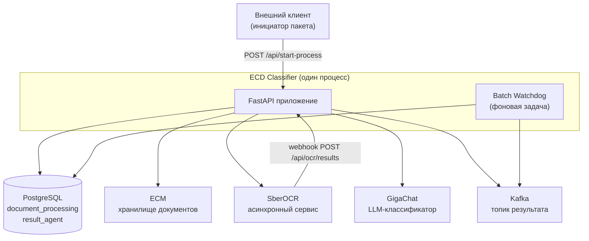
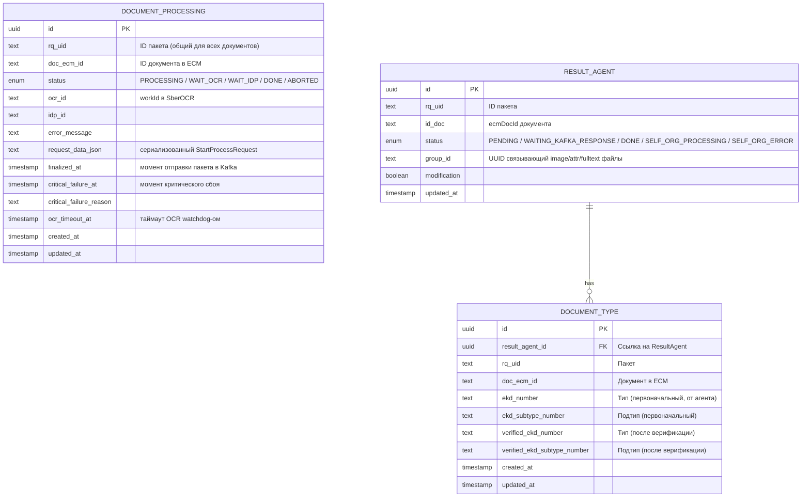
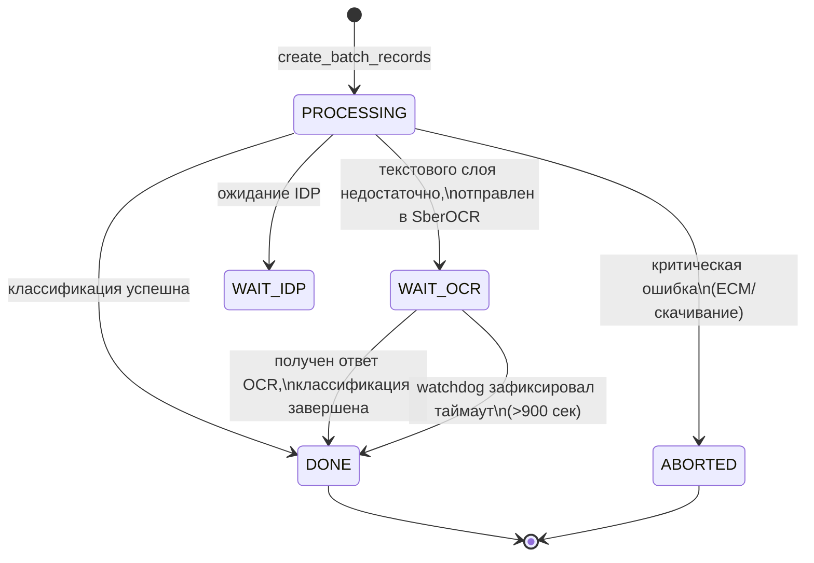
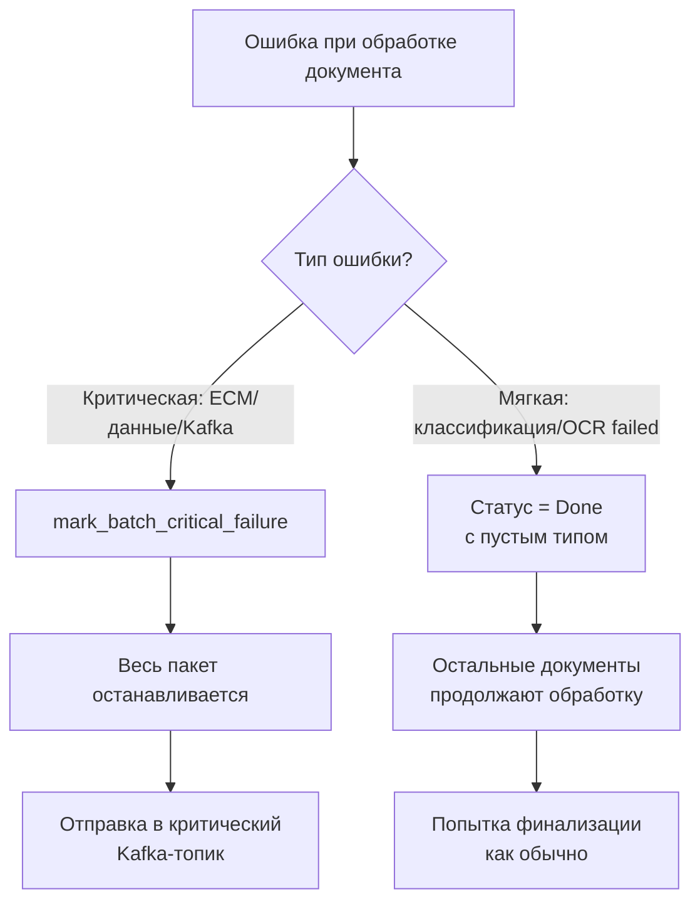
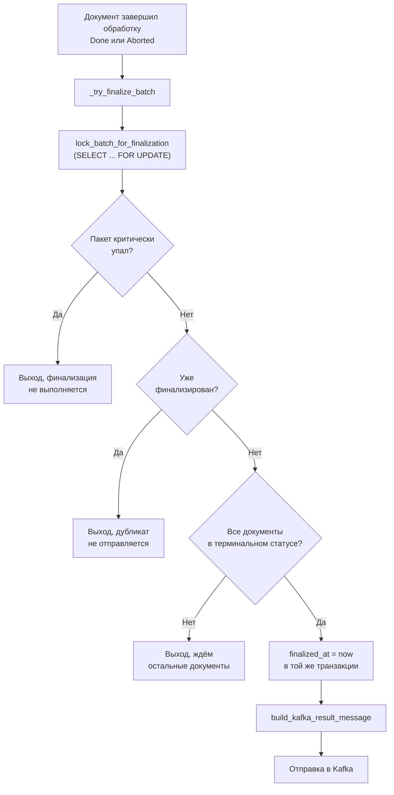
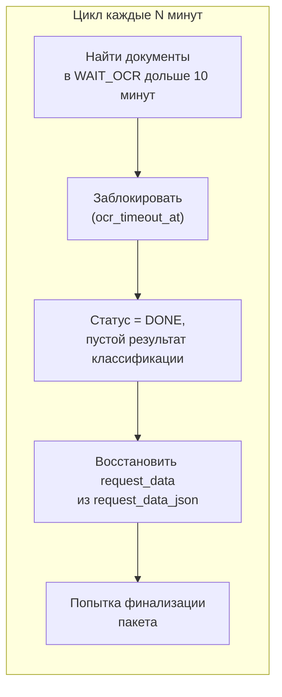
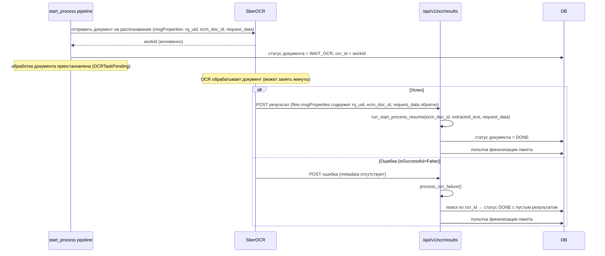

# Это пример архитектурного файла одного из моих проектов, мне в целом нравится тут структура и описание.


# Архитектура ECD Classifier (ClassiLex)

> **Версия:** 0.0.2
> **Дата обновления:** 2026-08-04
> **Назначение:** Микросервис автоматической классификации юридических/банковских документов по внутреннему справочнику ЭКД (Единый Каталог Документов)
> **Команда:** LegalDocs ПО ПД

---

## Содержание

1. [Назначение сервиса](#1-назначение-сервиса)
2. [Технологический стек](#2-технологический-стек)
3. [Высокоуровневая архитектура](#3-высокоуровневая-архитектура)
4. [Структура проекта](#4-структура-проекта)
5. [Жизненный цикл приложения (lifespan)](#5-жизненный-цикл-приложения-lifespan)
6. [API Endpoints](#6-api-endpoints)
7. [Модель данных и БД](#7-модель-данных-и-бд)
   - [7.1. Таблицы](#71-таблицы)
   - [7.2. Схема таблиц](#72-схема-таблиц)
   - [7.3. Статусы документа](#73-статусы-документа)
8. [Главный пайплайн классификации](#8-главный-пайплайн-классификации)
   - [8.1. Схема работы](#81-схема-работы)
   - [8.2. Детальный флоу](#82-детальный-флоу)
   - [8.3. Пошагово: что происходит с одним документом](#83-пошагово-что-происходит-с-одним-документом)
   - [8.4. Обработка ошибок](#84-обработка-ошибок)
   - [8.5. Финализация пакета](#85-финализация-пакета)
   - [8.6. Batch Watchdog](#86-batch-watchdog)
9. [Асинхронный OCR-цикл](#9-асинхронный-ocr-цикл)
10. [Self-Organization](#10-self-organization)
    - [10.1. Назначение](#101-назначение)
    - [10.2. Flow](#102-flow)
    - [10.3. Компоненты](#103-компоненты)
11. [ECM-интеграция](#11-ecm-интеграция)
    - [11.1. Структура файлов на диске](#111-структура-файлов-на-диске)
    - [11.2. Загрузка в ECM](#112-загрузка-в-ecm)

---

## 1. Назначение сервиса

Банковская система ECM хранит входящие документы (договоры, заявления, платёжки и т.д.). Для каждого документа нужно определить его тип и подтип по внутреннему справочнику ЭКД — это делается вручную либо автоматически.

**ClassiLex** — сервис автоматической классификации:

- принимает на вход **пакет документов** (один HTTP-запрос может содержать несколько `ecmDocId`);
- скачивает каждый документ из ECM;
- извлекает текст (напрямую или через SberOCR, если текстового слоя недостаточно);
- классифицирует текст через **GigaChat** по многоуровневому дереву категорий;
- загружает результат (JSON с текстом, JSON с ответом классификатора) обратно в **ECM**;
- отправляет итоговое сообщение по всему пакету в **Kafka**;
- поддерживает **Self-Organization** — автоматическое улучшение таксономии по расхождениям с внешними ответами.

---

## 2. Технологический стек

| Слой | Технология |
|---|---|
| Web-фреймворк | FastAPI |
| Работа с БД | SQLAlchemy (ORM) + PostgreSQL |
| Миграции | Alembic |
| LLM-классификация | GigaChat API |
| OCR | SberOCR (асинхронный, через webhook) |
| Очереди сообщений | Kafka (aiokafka) |
| DI-контейнер | Dishka |
| Логирование | structlog |

---

## 3. Высокоуровневая архитектура



Сервис — единое FastAPI-приложение, внутри которого крутится фоновая задача (watchdog). Взаимодействие с внешним миром идёт через четыре канала: ECM (скачать/загрузить файлы), SberOCR (распознавание текста), GigaChat (классификация), Kafka (результаты и ответы АС ПО).

---

## 4. Структура проекта

```
classilex/
├── src/
│   ├── api_server.py                 # Точка входа FastAPI (uvicorn)
│   └── ecd_classifier/               # ─── Ядро сервиса ───
│       ├── app.py                    # FastAPI app: lifespan, middleware, DI, Kafka, CriticalKafkaProducer
│       ├── classify.py               # DocumentClassificationService — оркестратор классификации
│       ├── pipeline.py               # DocumentClassifier — пошаговая LLM-классификация
│       ├── prompts.py                # Системные промпты GigaChat
│       ├── constants.py              # Константы
│       ├── retry_ssl.py              # Retry-транспорты + SSL для GigaChat/OCR
│       │
│       ├── api/                      # ─── HTTP API ───
│       │   ├── __init__.py           # api_router (объединение роутеров)
│       │   ├── middlewares.py        # RequestIDMiddleware, AccessLogMiddleware
│       │   └── endpoints/v1/
│       │       ├── process.py        # POST /api/v1/start-process (главный endpoint)
│       │       ├── ocr.py            # POST /api/v1/ocr/results (callback SberOCR)
│       │       └── verification_statistics.py  # GET /api/v1/statistics/verification (НОВЫЙ)
│       │
│       ├── configs/                  # ─── Конфигурация ───
│       │   ├── config.py             # Pydantic Settings (+ critical_kafka, start_process_consumer_topic)
│       │   ├── constants.py          # RUNTIME_CONFIGURATION
│       │   └── logger.py             # structlog настройка
│       │
│       ├── database/                 # ─── Слой БД (SQLAlchemy + Alembic) ───
│       │   ├── base.py               # Engine, DatabaseManager, DatabaseSession
│       │   ├── models.py             # ORM: CategoriesTree, ResultAgent, DocumentProcessing, DocumentType
│       │   ├── statuses.py           # Enums: ResultAgentStatus, DocumentProcessingStatus
│       │   └── document_processing_repo.py  # Репозиторий: CRUD + блокировки (вынесен из сервисов)
│       │
│       ├── repositories/             # ─── Репозитории (НОВАЯ директория) ───
│       │   ├── __init__.py
│       │   ├── self_org.py           # SelfOrganizationRepository (925 строк, worker thread)
│       │   └── verification_statistics.py  # Агрегация статистики верификации
│       │
│       ├── services/ecm/             # ─── ECM интеграция ───
│       │   ├── ecm_d.py              # Скачивание (пакетное, параллельно с semaphore)
│       │   └── ecm_u.py              # Загрузка (PDF-конвертация через soffice, group_id, attrs)
│       │
│       ├── kafka/                    # ─── Kafka ───
│       │   ├── producer.py           # KafkaProducer (параметризованный broker, SSL/PLAINTEXT)
│       │   ├── consumer.py           # KafkaConsumer (2 subscriber-а: ASPO ответы + триггеры запуска)
│       │   ├── message_builder.py    # Сборка Kafka-сообщения (per-document, groupId, documentSubTypes)
│       │   └── critical_failure.py   # Отправка сообщений о критическом сбое (отдельный topic)
│       │
│       ├── clients/                  # ─── HTTP-клиенты ───
│       │   ├── giga.py               # GigaChatAPI (sync/async, retry, SSL)
│       │   ├── ecm.py                # ECM HTTP-клиент
│       │   └── ocr.py                # OCRClient (SberOCR)
│       │
│       ├── models/                   # ─── Pydantic модели ───
│       │   ├── base.py               # Базовая модель с camelCase алиасами (НОВЫЙ)
│       │   ├── common.py             # FileSource, ExtractionResult
│       │   ├── classification.py     # ClassificationRequest/Response
│       │   ├── process_request.py    # Header, EcmParams, StartProcessRequest/Response
│       │   ├── kafka_process_request.py  # Kafka-триггер модели (KafkaStartProcessMessage)
│       │   ├── self_org.py           # Self-org модели (KafkaProcessingResult, DocumentInfo)
│       │   ├── verification_statistics.py  # REST API статистики верификации
│       │   ├── response.py           # EcmResponse, DocumentResponse
│       │   └── ocr.py                # Модели SberOCR-интеграции (ecm_doc_id в MsgProperties)
│       │
│       ├── services/                 # ─── Бизнес-логика ───
│       │   ├── start_process.py      # run_start_process_pipeline (ПЕРЕПИСАН: пакетная обработка)
│       │   ├── start_process_trigger.py  # Kafka-триггер запуска пайплайна (НОВЫЙ)
│       │   ├── kafka_request_mapper.py   # Kafka→StartProcessRequest маппинг (НОВЫЙ)
│       │   ├── text_extractor.py     # TextExtractor — обёртка над extractors
│       │   ├── ocr.py                # OCRProcessor — синхронный/асинхронный SberOCR
│       │   ├── categories_tree_service.py   # Навигация по дереву категорий
│       │   ├── aspo_response.py      # Обработка ответов АС ПО (типизированный, через repository)
│       │   ├── batch_watchdog.py     # Watchdog для зависших в OCR документов (вынесен отдельно)
│       │   ├── verification_statistics.py  # Формирование статистики верификации (НОВЫЙ)
│       │   └── document_processor/   # Стратегия загрузки дерева
│       │       ├── base.py           # Protocol
│       │       ├── csv_service.py    # CSV-реализация
│       │       └── postgres_service.py   # PostgreSQL-реализация
│       │
│       ├── self_organization/        # ─── Self-Organization ───
│       │   ├── facade.py             # SelfOrganizer — фасад
│       │   ├── reflection_service.py # Оркестратор рефлексии
│       │   ├── description_flow.py   # Улучшение описаний категорий
│       │   ├── new_type_flow.py      # Добавление новых типов
│       │   ├── testing.py            # Тестирование изменений таксономии
│       │   ├── llm.py                # LLM-клиент для self-org
│       │   ├── taxonomy.py           # Построение таксономии
│       │   ├── models.py / config.py / prompts.py / utils.py
│       │   └── local_runs/           # Скрипты локального тестирования
│       │
│       ├── extractors/               # ─── Извлечение текста (ПЕРЕПИСАН) ───
│       │   ├── __init__.py           # Публичный API
│       │   ├── __main__.py           # CLI entry
│       │   ├── _logging.py           # Встроенный логгер пакета
│       │   ├── bootstrap.py          # Сборка реестра (~26 handlers, markdown-render)
│       │   ├── cli.py                # CLI для тестирования извлечения
│       │   ├── errors.py             # ErrorCodes
│       │   ├── facade.py             # FileTextExtractor — фасад (extract_text, extract)
│       │   ├── interfaces.py         # Базовые абстракции
│       │   ├── markdown_render.py    # MarkItDown renderer
│       │   ├── mime_detect.py        # MagicMimeDetector (расширен)
│       │   ├── ocr.py                # OcrStub
│       │   ├── registry.py           # ExtractorRegistry
│       │   ├── text_layer.py         # Text layer analysis
│       │   ├── types.py              # FileSource, ExtractionResult, ExtractionStatus
│       │   └── handlers/             # Конкретные экстракторы (~26 handlers)
│       │       ├── base.py           # Базовые классы
│       │       ├── pdf.py            # PDF
│       │       ├── docx.py           # DOCX
│       │       ├── txt.py            # TXT
│       │       ├── csv.py            # CSV
│       │       ├── excel.py          # Excel
│       │       ├── rtf.py            # RTF
│       │       ├── html.py           # HTML
│       │       ├── xml.py            # XML
│       │       ├── _markdown.py      # Markdown через markitdown
│       │       ├── _soffice.py       # Конвертация через LibreOffice
│       │       ├── best_effort.py    # DJVU, PostScript, PSD
│       │       ├── csv_tsv.py        # CSV/TSV
│       │       ├── data.py           # SQLite, Tabular
│       │       ├── doc.py            # DOC
│       │       ├── email_msg.py      # Email MSG
│       │       ├── epub.py           # EPUB
│       │       ├── fitz_doc.py       # MuPDF
│       │       ├── image.py          # Изображения
│       │       ├── opendocument.py   # OpenDocument
│       │       ├── pim.py            # iCS, vCF
│       │       ├── plain_text.py     # Plain text
│       │       ├── powerpoint.py     # PPTX
│       │       ├── recognized.py     # Распознанные
│       │       ├── structured.py     # JSON, YAML
│       │       └── web_docs.py       # MHTML, Notebook
│       │
│       ├── utils/                    # ─── Утилиты ───
│       │   ├── container.py          # dishka DI-контейнер (async + sync)
│       │   ├── providers.py          # DI-провайдеры (+ CriticalKafkaProducer)
│       │   ├── classification.py     # map_classification_to_ekd
│       │   ├── exceptions.py         # AgentError, OCRServiceError, OCRTaskPending, NotEnoughDataInDocumentError
│       │   ├── metrics.py            # Prometheus-метрики
│       │   ├── pages.py              # get_page_count (PyMuPDF)
│       │   └── trace_id_context.py   # Trace ID management
│       │
│       ├── tracing/                  # ─── AEF Tracing (OpenTelemetry) ───
│       │   ├── aef_manager.py        # aef_tracking() context manager
│       │   └── kafka_setup.py        # Kafka-трейсинг и инициализация
│       │
│       └── front/                    # ─── Streamlit фронтенд ───
│           ├── st_class_front/       # Классификация документов
│           └── st_self_org_front/    # Self-organization UI
│
├── tests/                            # Тесты
├── scripts/                          # Docker entrypoint, миграции, ожидание secrets
├── alembic/                          # Миграции БД (5 версий)
│   ├── e14bf5dd2a83_add_doc_type_table.py
│   ├── 2780b164a88f_add_document_processing.py
│   └── c01d5a5191fe_add_group_id_to_result_agent.py
├── data/                             # CSV-файлы с деревом категорий
│   ├── documents/categories_tree.csv
│   └── front/*.csv
│
├── pyproject.toml                    # Зависимости, ruff, mypy, pytest, coverage
├── Dockerfile                        # Контейнеризация
├── Makefile                          # Команды: run-api, test, lint, format, typecheck
├── uv.lock                           # Lock-файл uv
├── alembic.ini                       # Конфигурация миграций
└── ARCHITECTURE.md                   # Этот файл
```

---

## 5. Жизненный цикл приложения (lifespan)

При старте FastAPI `app.py` выполняется:

1. **AEF Kafka Tracing** — инициализация OpenTelemetry через Kafka
2. **Kafka broker** — создание через `create_kafka_broker(kafka_config)` (SSL или PLAINTEXT)
3. **KafkaProducer** — запуск
4. **KafkaConsumer** — запуск, регистрация двух обработчиков: `consume_package_response` (ASPO ответы для self-org) и `consume_start_process_trigger` (триггеры запуска пайплайна)
5. **CriticalKafkaProducer** — инициализация отдельного продюсера для критических сбоев через DI-контейнер
6. **check_kafka_connection()** — проверка доступности Kafka
7. **batch_watchdog** — фоновая `asyncio.create_task()` (следит за зависшими в OCR документами)

При остановке:
1. Отмена watchdog (cancel + await)
2. Остановка CriticalKafkaProducer
3. Остановка KafkaProducer

---

## 6. API Endpoints

| Метод | Путь | Описание |
|---|---|---|
| `GET` | `/api/health/liveness` | Проверка живости → `{"status":"alive"}` |
| `GET` | `/api/health/readiness` | Проверка готовности → `{"status":"ready"}` |
| `GET` | `/metrics` | Prometheus метрики |
| **`POST`** | **`/api/v1/start-process`** | **Главный endpoint — запуск пайплайна классификации (пакет документов)** |
| **`POST`** | **`/api/v1/ocr/results`** | **Callback от SberOCR (поддерживает success/failure)** |
| **`GET`** | **`/api/v1/statistics/verification`** | **Статистика результатов верификации (dateFrom, dateTo)** |

---

## 7. Модель данных и БД

### 7.1. Таблицы

| Таблица | Назначение |
|---|---|
| `categories_tree` | Дерево категорий ЭКД |
| `doc_etalons` | Эталонные документы для тестирования |
| `result_agent` | Результаты обработки документов (обновлён: добавлены `status`, `modification`, `group_id`) |
| `document_processing` | Статус обработки каждого документа внутри пакета |
| `document_types` | Первоначальные и верифицированные типы документов (перенесены из `result_agent`) |

### 7.2. Схема таблиц



`rq_uid` — сквозной идентификатор всего пакета (совпадает с `rqUID` из исходного запроса). `doc_ecm_id` — идентификатор конкретного документа внутри пакета.

Уникальный индекс на паре `(rq_uid, doc_ecm_id)` в `document_processing` — на один документ пакета ровно одна строка.

### 7.3. Статусы документа



`DONE` и `ABORTED` — терминальные статусы. Пакет считается завершённым, когда **все** его документы находятся в одном из этих двух статусов.

---

## 8. Главный пайплайн классификации

### 8.1. Входные точки

Два независимых входа в `run_start_process_pipeline()`:

1. **HTTP**: `POST /api/v1/start-process` — клиент отправляет `StartProcessRequest`, сервис возвращает 200 сразу, обработка в фоне
2. **Kafka**: `start_process_consumer_topic` — `KafkaStartProcessMessage` → `kafka_request_mapper` → маппинг в `StartProcessRequest` → тот же пайплайн

`start_process_trigger.py` содержит проверку `batch_already_exists(rq_uid)` — предотвращает повторную обработку при at-least-once доставке Kafka.

### 8.2. Схема работы

```
POST /api/v1/start-process  (или Kafka-триггер)
│
├── 1. create_batch_records(rq_uid, [ecmDocId_1, ..., ecmDocId_N])
│   → N строк в document_processing, статус PROCESSING
│
├── 2. download_documents_from_ecm([...]) — параллельно, semaphore=CONFIG.ecm.max_concurrent_ecm_downloads
│   ├── [OK] → DocumentInfo(filePath, fileBytes, ...)
│   └── [FAIL] → DocumentInfo(error="...")
│
├── 3. Если хотя бы 1 failed → mark_batch_critical_failure(reason)
│   → ALL документы = critical_failure_at + send_critical_failure_message(Kafka)
│
└── 4. Для каждого OK-документа — _process_single_document_task (parallel, semaphore):
    │
    ├── 4a. DocumentClassificationService.process_single_file()
    │   ├── TextExtractor.extract_from_file()
    │   │   ├── extractors bootstrap: PDF → markitdown → office → best_effort → plain text
    │   │   └── если текста недостаточно → SberOCR (async)
    │   │       → OCRTaskPending → STATUS = WAIT_OCR → return
    │   └── DocumentClassifier.classify() — LLM-классификация
    │       └── если ошибка → soft failure: пустые типы, статус DONE
    │
    ├── 4b. upload_document_folder_to_ecm() — конвертация в PDF если нужно, attrs из классификации
    ├── 4c. update_document_status(Done/Aborted)
    ├── 4d. save_agent_result_to_db() → ResultAgent + DocumentType
    │
    └── 4e. _try_finalize_batch() — SELECT FOR UPDATE
        └── если все DONE → finalized_at → Kafka
```

Запрос обрабатывается по схеме fan-out: все документы пакета запускаются параллельно (`asyncio.gather` с ограничением через семафор), каждый — в изолированной задаче `_process_single_document_task`.

### 8.3. Обработка ошибок

Сервис различает два типа ошибок:

| Тип | Примеры | Что происходит |
|---|---|---|
| **Критическая (hard failure)** | 1) Не скачался документ из ECM <br/>2) `NotEnoughDataInDocumentError` (невозможно OCR) <br/>3) Kafka недоступна при финализации | Весь пакет останавливается. Сообщение о сбое уходит в отдельный Kafka-топик через `CriticalKafkaProducer` |
| **Мягкая (soft failure)** | 1) Не удалось классифицировать текст <br/>2) OCR вернул ошибку (`isSuccessful=False`) <br/>3) Документ завис в OCR >10 мин | Документ помечается `Done` с пустыми `documentType`/`documentSubType`. Остальные документы продолжают обработку |



### 8.4. Финализация пакета

Финализация — момент, когда собирается и отправляется итоговое Kafka-сообщение по всему пакету. "Триггер" финализации не централизован — её пытается выполнить **каждый** документ после своего завершения.



Такой подход — "polling через побочный эффект" — работает без отдельного координатора: пока хотя бы один документ не завершён, все попытки финализации выходят рано. Как только завершается последний, именно его вызов застаёт пакет полностью готовым.

Защита от гонки — `SELECT ... FOR UPDATE`: строки пакета блокируются, только один параллельный вызов проставит `finalized_at`, остальные увидят уже заполненное поле.

Если отправка в Kafka внутри транзакции падает — транзакция откатывается, `finalized_at` возвращается в `NULL`, watchdog повторит финализацию.

**Изменения в Kafka-сообщении:**
- `documentType`/`documentSubTypes` — **на каждый документ individually**, а не на весь пакет
- `_index_results_by_ecm_doc_id()` — O(1) индексация результатов
- `fulltext` исключён из сообщения (только image + attr)
- `groupId` добавлен в `customProperties` каждого документа
- `documentSubTypes` (множественный) вместо `documentSubType`
- `subjectName` добавлен в `customParams`

### 8.5. Batch Watchdog

**Проблема**: если документ ушёл в OCR, а ответ так и не пришёл (сервис недоступен, документ потерян), пакет зависнет в статусе `WAIT_OCR` навсегда. Watchdog решает эту проблему.



Watchdog вынесен в отдельный файл `services/batch_watchdog.py`, запускается как фоновая `asyncio`-задача в `lifespan`. `ocr_timeout_at` — защита от повторной обработки зависшего документа.

---

---

## 9. Асинхронный OCR-цикл

SberOCR — асинхронный сервис: он не возвращает результат сразу в ответ на запрос, а присылает его позже отдельным HTTP-запросом (webhook) на `/api/v1/ocr/results`. Это значит, что обработка документа не может быть одной непрерывной функцией — она распадается на две части, соединённые через OCR.



Ключевой момент — SberOCR **возвращает обратно** все метаданные, которые ему передали в `msgProperties` (включая `ecm_doc_id` и сериализованный `request_data`). Это позволяет webhook-обработчику `/api/v1/ocr/results` понять, к какому именно документу какого пакета относится пришедший результат.

Если OCR возвращает ошибку (`isSuccessful=False`) — метаданных в ответе нет, поэтому документ ищется по `ocr_id = workId` напрямую в БД.

---

## 10. Self-Organization

### 10.1. Назначение

Автоматическое улучшение таксономии на основе расхождений между **ServiceAnswer** (ответ сервиса) и **HumanAnswer** (внешний ответ из Kafka/АС ПО).

### 10.2. Flow

```
Получен ответ АС ПО (Kafka)
  → KafkaProcessingResult (Pydantic-валидация, типизированный)
  → SelfOrganizationRepository.start_package() — атомарный захват
  → initialize_documents() — подготовка к обработке
       ├── Сравнение EKD: ServiceAnswer vs HumanAnswer
       │
       ├── [Совпадают] → no_change, статус done
       │
       ├── [EKD не существует в таксономии] → NewTypeFlow
       │   ├── LLM предлагает новый тип документа
       │   ├── Валидация (базовые правила, ссылочная целостность)
       │   ├── Тестирование на документе
       │   └── Если тест пройден → атомарная запись
       │
       └── [EKD существует, но классификатор ошибся] → DescriptionRefinementFlow
           ├── Диагностика уровня ошибки (macro/mega/sub/mini/final)
           ├── LLM генерирует улучшенное описание
           ├── Патч таксономии
           ├── Ре-классификация того же документа
           └── Если тест пройден → атомарная запись
```

### 10.3. Компоненты

- **SelfOrganizationRepository** (`repositories/self_org.py`, 925 строк) — изолирует все SQLAlchemy-операции в worker thread. Атомарные операции: `start_package()`, `initialize_documents()`, `persist_verified_document_types()`, `mark_document_wait_ocr()`, `mark_document_done()`, `claim_ocr_callback()`.
- **ReflectionService** (`reflection_service.py`) — оркестратор рефлексии
- **DescriptionRefinementFlow** (`description_flow.py`) — уточнение описаний
- **NewTypeFlow** (`new_type_flow.py`) — добавление новых типов
- **ClassificationTestRunner** (`testing.py`) — тестирование на документе (CSV-режим или PostgreSQL-транзакция с откатом)
- **process_aspo_response(message: KafkaProcessingResult)** — принимает типизированный Pydantic-объект вместо сырого dict

---

## 11. ECM-интеграция

### 11.1. Структура файлов на диске

```
work_dir/{rqUID}/{ecmDocId}/
├── original.{ext}        # исходный документ
├── ocr.json              # результат OCR
└── response.json         # результат классификации
```

### 11.2. Загрузка в ECM

**Конвертация форматов в PDF перед upload:**
Форматы `.pptx`, `.csv`, `.ods`, `.odp`, `.txt`, `.htm`, `.html` конвертируются в PDF через `soffice --headless` перед загрузкой в ECM (ECM не отображает эти форматы напрямую).

**group_id:**
UUID, связывающий файлы `image`, `attr`, `fulltext` одного документа при загрузке в ECM.

**attrs для классификации:**
`_build_doc_type_attrs()` формирует атрибуты для ECM (`docTypeListDictionaries`, `docTypeDictionary`) из результата классификации. `attrs: list[dict[str, Any]]` — тип изменён с одиночного dict на list.

**source_doc_ecm_id:**
Определяется по пути файла, используется для сопоставления с классификацией.

**Типы файлов:**
- оригинал → `image`
- `ocr.json` → `fulltext`
- `response.json` → `attr`
